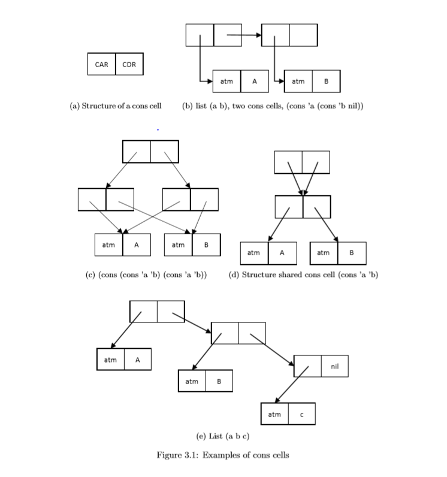

Chapter 3   
Lisp: Functions, Recursion, and Lists
===

### 3.1 Lisp History
1950년대 인공지능 개발을 위해서 Mit에서 만듬

---
### 3.2 Good Language Design

Motivating Application
-  Reasoning and symbolic processing
-  Decing which features to leave out
   - Symbol 자체를 언어의 data값으로 하자
   - Syntax 매우 쉬움

   
Abstract Machine
- Unabiguous program execution model
- Guide for implentation

Theoretical Foundataions
- Turing complete
  -  모든 Partial Recursive Function들은 Lisp으로 쓰여질수 있다.
- 람다 대수의 수학적 특성을 가지고있음
  - 람다 대수는 Partial Recursive Function을 정의하는 가장 단순한 형태의 Syntax
    - Lisp은 reduction,functional model이다. 즉 Program이 함수+인자 주면 Program이 평가해서 값을 주는 Style. 
    - 함수를 인자들에게 적용하는 Style

---

### Language Overview
**Lisp programs and data are S-expressions.**
- Lisp은 Atom과 S-expression으로 구성되어있다
- Atom은 Primitive Data Type 이고 , expression은 아톰이거나 expression들을 concat(cons cell로 연결) 한것이다.
    -  Atom은 정수, 플로팅 포인트, 심볼, 문자, nil 등이있다
    -  Function and special forms: cons, car, cdr, eq, atom, cond, lambda, define, quote, eval 등이 있다.
       - cons는 cons cell로 묶는것
       - car는 cons cell의 앞부분, cdr은 cons cell 의 뒷부분
       - eq는 reference가 같아야한다. equal 은 c++에서 구조체의 모든 값이 같을때 의 ==을 의미함
         - 같은 symbol은 reference가 같다.
         - 그러나 '(1 2 3) '(1 2 3) 은 같은 reference가 아니다.
           * 다른 cons cell을 쓰니까 당연히 아닌것임
         - '(1 2 3) '(1 2 3) 은 equal 일때 T가 나옴 eq는 reference가 달라서 NIL 이나온다
       - atom 은 주어진 인자가 Atom 인지 판단하는 것
       - cond 는 C언어의 Switch 문과 비슷하다
         - (cond (p1 e1) (p2 e2) ...) 이런 Syntax를 갖고 있고 조건(Predicate 평가하고 나서 T 일경우 e에 해당하는 부분이 전체 Expression 의 값이다.)
       - lambda는 람다함수 사용시
       - defun은 함수 정의할 때 사용
       - quote는 인자를 Symbol 처리할때
       - eval은 심볼자체를 값으로 평가할 때
     - Side effect: set,setq 거의 사용하지 않을 예정

    - (f arg1, arg2, ... arg N)
      - 첫번째 Symbol f를 함수나 Operator로 평가한다. Built in(Special form)?, 사용자 정의인지 알아야한다.
      - 그 후 일반함수(사용자 정의 함수)의 경우 인자들의 평가를 다 끝내고(Strict-Order) 함수를 인자에 적용
        - Short-circuit: (a||b) a를 평가하고 true일 경우 그 다음 b를 평가하지 않기 때문에 Strict-order가 아니다.


    - Function Definition 의 예
      - <pre>
        <code> (defun find (lambda (x y)
                    (cond ((equal y nil) nil)
                          ((equal x (car y)) x)
                          (t (find x (cdr y)))
                    )
            )
        </code>
        </pre>

    - Function Application 의 예
    <pre>
    <code> (find 'apple '(pear peach apple fig banana))</code></pre>

---

### 3.4 Innovations in the design of Lisp

#### 3.4.1 Statements and Expressions

**Expression: 값을 평가하는것**
- 폰노이만 머신에서 Processor와 Register와 관련된일들, Alu operation

**Statement: 머신의 상태를 바꾸는것**
- Side effect를 일으킴, 기계의 State를 변화시킴
  
**Declaration: ~의 값은 ~다 라고 Binding 해주는것**
- C의경우 int variable=1; 
  - function style 에서는 Memory 개념이 없기 때문에 한번 binding 하고나면 값이 바뀌지 않는다.
  - 위의 예는 변수로만 설명이 되어있는데 함수 선언도 마찬가지
  - introduces a new anme with one or more attributes.

# 

#### 3.4.2 Conditional Expressions

<pre><code> (cond (p1 e1) (p2 e2) ... (pn en))</code></pre>

- 연속된 conditional expression
- strict order 가아님 pn 중에 조건이 참이면 전체 expression은 en 으로 평가된다.
  
# 

#### 3.4.3 The Lisp Abstract Machine

**A continuation**
  - expression을 평가 했으면, 계속 되어야 하는 계산을 함수로 나타냄. 모든 Program이 다 끝나고 나면 Identity funcion
    - 계산한 Expression을 다음 Continuation 에 넘겨주면 계속 계산을 진행해 나가다가 프로그램이 끝나면 Identity Function
    - 즉 Identity function은 자기 자신을 return 하니 더이상 계산할 것이 없는것이다.

**An association list**
  - Binding 들의 묶음. Assembly에 Stack Frame과 비슷하다 (현재 진행되고있는 Expression 평가의 환경을 나타냄)

**Heap(힙)은 cons cell 저장**
  -  Heap이 고갈 되면 G.C 돌려서 메모리 수거해옴

**Expression을 평가하는 과정**
Expression이 평가될때, Association list에 가서 바인딩 되어있는 것을 뒤져보고, 없으면 에러, 있다면 계산하고 나서 다음 continuation으로 계산한것이 전달된다.

# 

#### 3.4.4 Program as Data 

**Data와 Program이 Syantax가 똑같음**


# 

#### 3.4.5 Functions Expressions

**함수가 값이 될수 있음=> 값이 될 수 있다?=> Parameter로 전달이 가능하고 Return값으로 받을수 있고 Member 변수 값으로 가능 하다는 소리**

Anonymous function: lambda-expression
  - (lambda (x) (+ x 1)): x를 x+1로 mapping
  - ((lambda (x) (+ x 1)) (+ 1 2)): (+ 1 2)를 3으로 계산한후 3을 저 람다식에 인자로 공급함
  - ((lambda (x) (+ x y)) 4): y는 lambda 에 binding 되어있지 않아서 Free,Global variable이다.

# 

#### 3.4.6 Recursion

<pre><code> (defun f (x) 
                (cond ((eq x 0) 1
                (t (* x (f (- x 1)))))))</code></pre>

성능이 떨어 질 수 있음. 그래서 loop를 많이사용하는데    
Recursion이 해석이 더쉽다


# 

#### 3.4.7 Higher-order Function 
함수를 인자로 보거나, Return 값으로 받거나   
예시는 다음과 같다
  - (defun compose (f g) (lambda (x) (funcall f (funcal g x))))
  - (defun inc-by (n) (lambda (x) (+ x n)))
    - lambda 에서 x는 지역변수 n은 외부에서 갖고와야함
    - inc-by 인자로 전달해줌 n은
  - (inc-by 1) 하면 1은 n이랑 binding 된 후 계산을 계속 함
  - (funcall (compose (inc-by 1) (inc-by 1)) 1)
    - 결국에는 1++ ++해서 3
  - (mapcar (inc-by 2) '(1 2 3 4))
    - 2를 list에다가 각각 더해줌

#### 3.4.8 Garbage Collections
**Lisp은 cons cell을 많이 만들어 내서 G.C 가 필요함**

Garbage: 메모리 위치에 접근할수 없는것을 뜻함   

(car (cons e1 e2)) e1만 Expression으로 평가되고 e2은 어디서 참조하는 것이 없으므로 Garbage가 되버림

Garbage Collection Algorithm
1. 사용하지 않는 것들을 모두 bit 0으로 색칠
2. 그 들중 참조되는 것이 있으면 bit 1로 색칠
3. 아직까지도 0인게 있으면 Free list로 돌려보냄

Overhead 5%가 있다
만약 원자력발전소 같은 시스템이 갑자기 몇초라도 멈추면 안되는 곧에서 G.C 가있는 언어로 Program을 짜면 안된다.   
Function Style은 거의 G.C 가있다.=>Higher-order function이 있어서 언제 Release 될지 모르기때문   
G.C 가 언제 동작할지 정확히 예측하지 못함

메모리 누수가 나는 프로그램과 안나는 프로그램의 예
<pre><code> tyedef struct cell cell;
 struct cell {cell * car, cell * cdr};

 cell * select (cell *x, cell *l){
     cell *p;
     for(p=;; p!=NULL;){
         if(p->car==x)
            return (p->cdr);
         else
            p=p->cdr;
     }
 }
 </code></pre>

 위에코드는 그냥 훓어 버리는것이기 때문에 Memory leak 발생

 <pre><code> cell * select(cell *x, cell *l){
     cell *p, *prev;
     for(p=;; p!=NULL;){
         if(p-> car ==x)
            return (p->cdr)
         else
             prev=p;
        p=p->cdr;
        free(prev);
     }
 }

 </code></pre>
이전에 훓었던것들 free 시켜줌

---


### 용어 설명 
Special form: 함수 위치에 나오지만 함수가 인자들이 적용될때와는 다른 방식으로 작동하는것(Strict 하지 않다)   

Side effect: 초기화와는 다른개념. 메모리에 어떤 State가 저장되어 있는데 그 State를 bit 조작을 통해 다른 State로 Update하는것. 예시는 다음과 같다.
```
t=t+1; 
```

Strict Order: 함수가 인자에 적용하기전에 인자의 평가를 다 끝내야 하는것

State(상태): 기억소자의 Bit들 =>(추상화) 변수의 값이 뭐냐?를 물어보는 것

Callback Function: 호출하는 함수가 뭔지는 모르지만 함수가 들어오길 기다림. 거기다가 Pointer 전달