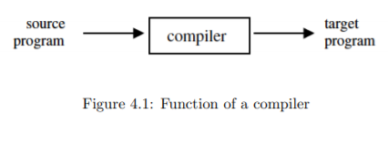
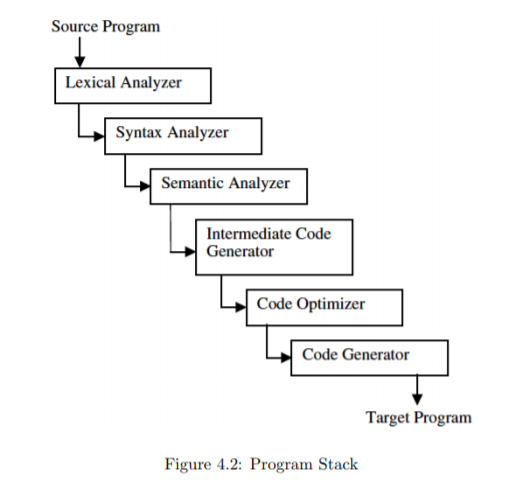
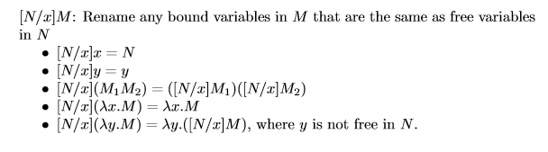
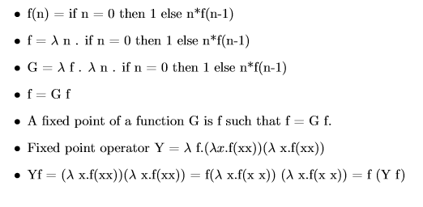

Chapter 4   
Fundamentals
====
## 4.1 Compilers and Syntax

### 4.1.1 Grammars and Parse Trees

Language *L*은 Alphabet의 Symbol로 구성된 문자열의 집합이다.   

Symbol은 non-terminal-symbol, terminal-symbol 두가지가 있다.   

Grammar G= {N, $\Sigma$, P, S}

- N: non-terminal-symbol, place-holder의 역할을 한다. 나중에는 N이 다 대체되어서 alphabet(terminal)이 된다
- P: Production-Rule, 다른 Symbol로 바꿔쓰는 규칙
- S: Start Symbol(Non-terminal Symoble 중 하나)
- $\Sigma$ : 알파벳(Alphabet)의 집합이다.

*L(G)*: 유한횟수만에 원하는 String 이나오면, 그 문법에 언어이다.   

모든것이 terminal로만 이루어져 있다면 derivation이 끝남

Derivation: string을 BNF에 의해 다시 쓰는것  

    Start Symbol에서 시작해서 non-terminal 하나잡고 Production rule에 의해서 바꿔쓰는것.

Parse tree: Derivation을 Tree 형태로 나타내는것   
- Parse tree가 존재하면 문법에는 맞는데 Ambiguity 가 발생할 수 있음

Ambiguity: 우선순위, 결합방향을 문법이 반영하지 않으면 발생하는 문제   
ex) Dangling else Problem

### 4.1.2 Structure of a simple compiler

Compiler는 syntax translator임   
Interpreter: 프로그램이 의미한 바가 무엇이냐를 해석한다.(Semantic Translator)

- Compiler와 Interpreter의 공통점은 둘다 Translator 이다.
- Interpreter는 Software Interpreter가 micro processor의 계산력 받아서 실제 로직은 Program에서 돌아감

- Lexical Analyzer
  - 프로그램을 거대한 String이라 생각하고 구문분석을 해서 넘겨준다.
  - 어휘 단위로 끊어줌(token: 의미를 갖는 최소 단위)
  - ex) #include, int 등과 같이
  
- Syntax Analyzer
  - 토큰들이 Parser의 terminal이 된다 => 구문분석(문법을 준수하는지)
  - parse tree만듬 
  - Type 검사를 하기위해서 AST를 만든다
  
- Semantic Analyzer
  - tpye 검사를 함. ex) 1+3.14 "두개 같이 계산못함"
    - 호환성이 있느냐 없느냐
  - 이 단계 거치고 나면 주로 target Program이 assembly 파일

- Intermediate Code Generator
  - Source Code와 Target Program 사이
  - 이파일은 Inter micro processor, sparc processor 로도 바뀔수 있음 .
  - == > 독립적

- Code Optimizer
  - +0, *1 과 같이 쓸데없는 alu 연산 없애준다
  - dead code 없애줌.
  - Loop Optimization
  - In-line function call

- Code Generator
  - register mapping(어떤 변수를 어떤 register 에 mapping 할건지)
  - 어떤 Instruction 쓸건지
  
- Target Program
  - 주로 assembly 언어 assembler가 0과 1로 번역후 machine instruction 만듬

---

## 4.2 Lambda calculus

### 4.2.1 Functions and Function Expressions
Lambda abstraction: $\lambda$x.x   
- Lisp의 (lambda (x) x) 와 같다 

Application:  $e_{1}$$e_{2}$ 
- $e_{1}$을 $e_{2}$에 apply

Reduction: ($\lambda$x.x) *M* giving *M*.
- ($\lambda$x.x)을 M에다가 APPLY 하면서 M을 준다. M이 무엇이든 간에

# 

### 4.2.2 Lambda Expressions
**Syntax**

M $\isin$ $\lambda$ - $expression$   
 M ::= x | *M* *M* | $\lambda$x.*M*

# 

**Variable binding**

- 변수가 묶였거나(bound variable), 묶이지 않았거나(free variable)
- $\lambda$ 는 binding operator. 
  - ex) $\lambda$x.M 은 x의 scope는 M 이라는소리
- $\alpha$-equivalent
  - 이름 바꿔주는 것
- *FV*(M): scope M에 있는 모든 Free variable
  - FV(x)={x}
  - FV(MN)=FV(M) $\cup$ FV(N)
  - FV($\lambda$x.M)= FV(M) - {x}
    - 몸체에 binding 된 Free variable 에서 x 만 빼주면된다.

- binding 의 정의
  1.  이름과 값의 결합
  2.  변수
  3.  변수의 연결되어 있는 값

lambda expression은 어떤 scope를 탄생하게 하는것(영역규정)   
유효한 범위가 scope내에서만 =>함수

# 

**Lambda abstraction**
- (lambda (x) function_body) = $\lambda$x.*function_body*
- Apply the following translation rule to the above C program, where
    <pre><code>  int f(int x){ return x;}
    block_body;</code></pre>

    저 위에 코드는 ($\lambda$*f*.*blockbody*)($\lambda$x.x) 로 번역된다.

# 
**Equivalence and Substitution**

$\alpha$-equivalence는 이름을 바꾸는것임 스코프내에서 스코프내에 있는 변수가 아닌것으로

($\lambda$x.M)N=[N/x]M 인데 N이 x대신 치고들어가야한다. 이때 N의 free variable이 ($\lambda$x.M)에 있는지 없는지 검사하고 들어가야함.   
: $\beta$-equivalence

있다면 ($\lambda$x.M)내에 변수를 $\alpha$-equivalence 를 통해 이름을 바꾼후 $\beta$-equivalence 진행해야함

만약 그렇지 않으면 변수이름이 충돌이 난다.

# 
아래 그림은 [N/x]M N에 나타나는 free variable 이 M 에 있는것과 같을때 해결할 수 있는 방법들

- 2번째 문장은 y를 x로 바꿔라 인데 바꿀게 없으니 그대로 y가 나온다.
- 3번째는 각각 적용하라 
- 4번째는 전역변수 가 있다하더라도 함수안에 지역변수에는 영향을 못미친다.
- 5번째 문장은 N에 free variable이 나타나면 y를 $\alpha$-equivalence로 이름을 변경하고 다시 적용해야한다.

# 

### 4.2.3 Recursion and Fixed Points

# 

### 4.2.4 Reduction, Confluence,and Normal Forms
- $\beta$-reduction
  - $\beta$-equivalence의 방향을 적용

- Normal forms: 더이상 줄여질수 없는 expression

- Confluence: 평가 순서가 expression에 final value에는 영향을 미치지않음   
  - expression이 $\beta$-reduction 을 거치고나면 어찌됐건 간에 하나의 normal form 으로 귀결이된다.
  - 함수들간의 application이 어느걸 먼저하든 상관이없다는 소리
  - C는 Confluence가 없다. Parameter의 계산 순서에따라 값이 달라질 수 있어서

**람다 대수는 Turing Complete 하다. == Partial Recursive function을 모두 만들수 있다**

**람다 대수는 Confluent 하다==> expression 의 평가 순서는 상관없이 값이 같다**

confluent는 assignment가 없는경우 confluent 하지만, assignment 가있을경우 confluent 하지않ㅇ므

--- 

## 4.4 Functional and Imperative Languages

### 4.4.1 Imperative and Declarative Sentences

자연어에는 4가지 종류의 sentence가 있다
- Imperative(명령문)
- Declarative(선언문)
- Interogative(의문문)
- Exclamatory(감탄문)
  
  프로그래밍 언어는 의문문, 감탄문은없다
  Imperative와 Declarative의 차이는 존재하는 값을 바꾸느냐(명령), 선언하느냐(선언)의 차이가 있다.

# 

### 4.4.2 Functional versus Imperative Programs

Functional languages: applicative

**Referential Transparency(참조 투명성)**
- 어떤 expression이 두개 있는데, 값이 같으면 바꿔 친다는 소리
- functional style은 assignment 가 없어서 중간에 값이 바뀔일 이 없기 때문에 Referential Transparency 가 쉽게 적용 가능하다
- Assignment 가 있는 Imperative style은 Referential Transparenct 적용 불가능 한 경우가 많다
- 만약 Imperative 에서도 중간에 assignment 없어서 프로그램이 진행됐다면, 초기화 한 값이 바뀌지 않은것이니 참조 투명성이 가능함

**Functional Programming and Conccurrency**
함수형 언어는 병렬처리가 가능하다 
- 인자를 병렬평가해서 그결과를 함수에 적용할수있음 (Confluent)

Imperative 
- 참조투명성이 없고 따라서 Confluent가 성립하지않는다. 평가순서가 매우중요하다. Strict Order

---
### 용어 설명
Compiler: 문법에 맞는지 안맞는지 Check하고, 맞으면 번역을 시작(Assembly 로)   
Alphabet: 구분 가능한 Symbol들의 집합, 공집합제외하고, 유한 집합이여야한다.
Dead code: 선언 되었지만 쓰지 않는 코드들