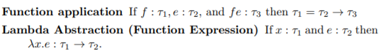
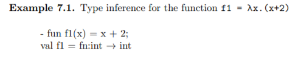
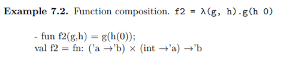
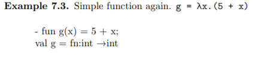
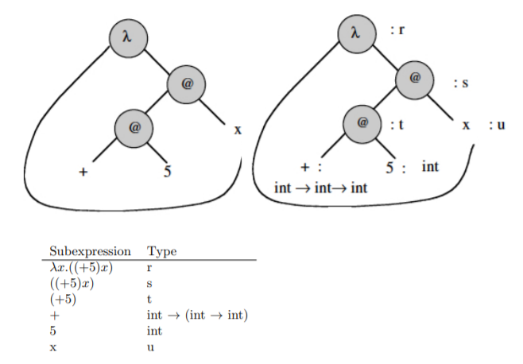
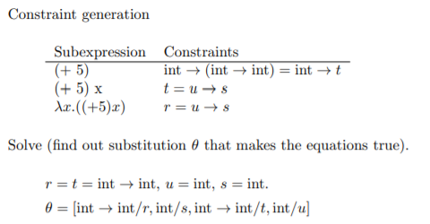

Chapter 7   
Types
===

## 7.1 Types in programming
Type은 computational entities의 집합이다.   
ex ) int
- 이름을 붙이고 개념을 조직
  - 오류도 덜나고 이해하기도 쉽다
    - ex) 맥박, 돈 둘다 정수인데 문제해결 입장에서 보면 같은 정수가 아니다. 맥박*돈 이렇게 계산하는건 말이 안되기때문

- 메모리의 bit sequence를 무엇으로 해석할 것인가
- compiler에게 data의 type을 알려주면 compiler는 최적화 하기도함
  - type은 Program의 오류도 줄이지만, Semantic(의미)를 더 강화 시켜줌
    - typedf로 같은정수라도 맥박이면 맥박, 돈이면 돈 이렇게 정의 해서 코딩하는게 더 좋다.

# 
### 7.1.1 Program Organization and Documentation
Data type이 문제가 발생한 실제 상황을 대변해줌 

# 
### 7.1.2 Type errors
- Hardware errors
- Unintended semantics
  - c나 java의 경우 algorithm을 잘못만들어 의도치않게 type error가 나는 경우가 있음

# 
### 7.1.3 Types and optimazation

 compiler가 type을 알면 최적화가 가능하다.

---
## 7.2 Type safety and type checking
- 어떠한 프로그램도 type distinctions을 위반하면 동작하지 않게 보장된다.
  - 돈에다 이자율을 곱하는것이 그예
- C는 type cast, pointer arithemetic, deallocation, dangling pointer 때문에 type safe 하지 않다.
  - dangling pointer 는 free 하고나서 그 pointer를 null해주지않을경우 발생하는문제
    - free space로 돌아간 메모리덩어리를 가르키고있음. 죽은사람에게 물어보는것과 마찬가지
  - pointer arithemetic은 주소에다가 몇 바이트를 더하는 형식을 취하고있다.
    - 이것은 computational entities의 경계를 불분명하게 만든다.
- java와 lisp 은 type safe

# 
### 7.2.1 Type Inference
- Runtime type checking: 프로그램의 overhead 발생
  - a.out 치고 그때 expression 평가
- Compile time type checking: type safe 문제 없다.  
  - runtime 때 안하므로 시간절약
- Combined: java의 배열 bound checking

---
## 7.3 Type inference
- Type checking vs. Type inference
  - Type checking 은 아주 작은 expression부터 type을 맞게 쓰는지 검사하는것
  - Type inference는 추측
- Polymorphism(다형성)

#

### 7.3.1 Type-inference algorithm
1. 알려진 것(int)들은 type assignment를하고, 모르는 것들은 미지수로 assignment
2. 제약조건 유도

   
제약조건 유도가 중요함 
Function application은 함수 f 가 $\tau$ 

3. unification 이용해서 제약조건을 푼다
   - 식과 미지수가 갯수가 맞지 않을수도있다. 이때 다형성이나옴 

# 

   
'+' operator는 정수전용, 2도 정수니깐 x는 정수일 수 밖에 없음   
만약 저 함수의 타입추론에서 int -> string 이 나왔다. 그러면 algorithm이 잘못된거고 디버깅이 쉽게 가능하다.

   
h의 type은 int -> a 로, g의 type은 a에서 b로   
h의 return type과 g의 input type이 같아야함   
'a 'b 둘다 type 변수임.

   

   
+는 5에 먼저 적용 되고 나서 그다음 x에 적용   
constarint는 람다, application 둘중 하나이다.

---
### 용어 설명
# 
computational entities: 실행시간 관여 혹은 문제해결을 표시하는데 쓰일 수 있다.   
# 
curried form: 함수가 하나의 인자씩만 받아서 해결 하는것. 여러개의 인자가 필요하면 함수를 return 하고 계속 받는다.