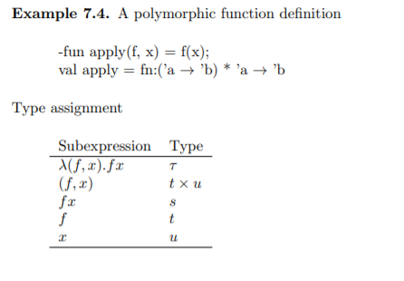
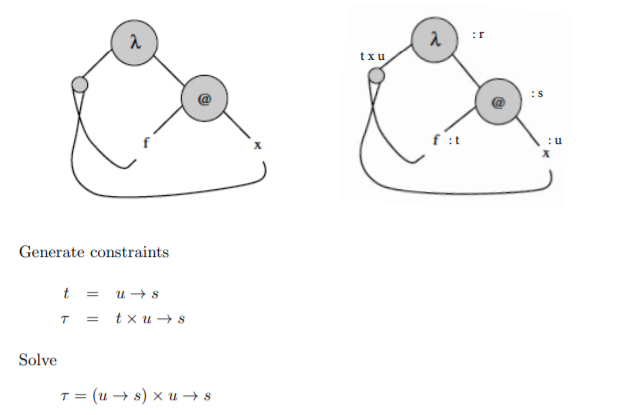
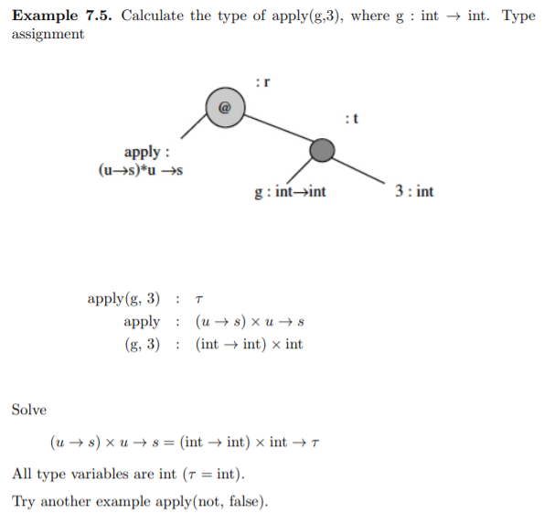
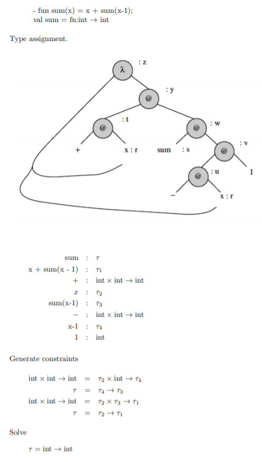
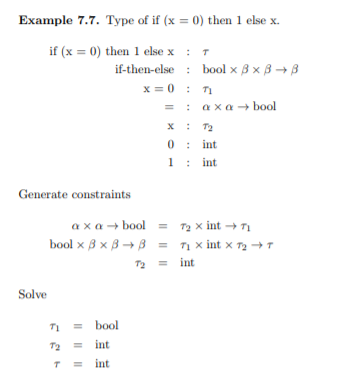

Chapter 7   
Types
===

## 7.1 Types in programming
Type은 computational entities의 집합이다.   
ex ) int
- 이름을 붙이고 개념을 조직
  - 오류도 덜나고 이해하기도 쉽다
    - ex) 맥박, 돈 둘다 정수인데 문제해결 입장에서 보면 같은 정수가 아니다. 맥박*돈 이렇게 계산하는건 말이 안되기때문

- 메모리의 bit sequence를 무엇으로 해석할 것인가
- compiler에게 data의 type을 알려주면 compiler는 최적화 하기도함
  - type은 Program의 오류도 줄이지만, Semantic(의미)를 더 강화 시켜줌
    - typedf로 같은정수라도 맥박이면 맥박, 돈이면 돈 이렇게 정의 해서 코딩하는게 더 좋다.

# 
### 7.1.1 Program Organization and Documentation
Data type이 문제가 발생한 실제 상황을 대변해줌 

# 
### 7.1.2 Type errors
- Hardware errors
- Unintended semantics
  - c나 java의 경우 algorithm을 잘못만들어 의도치않게 type error가 나는 경우가 있음

# 
### 7.1.3 Types and optimazation

 compiler가 type을 알면 최적화가 가능하다.

---
## 7.2 Type safety and type checking
- 어떠한 프로그램도 type distinctions을 위반하면 동작하지 않게 보장된다.
  - 돈에다 이자율을 곱하는것이 그예
- C는 type cast, pointer arithemetic, deallocation, dangling pointer 때문에 type safe 하지 않다.
  - dangling pointer 는 free 하고나서 그 pointer를 null해주지않을경우 발생하는문제
    - free space로 돌아간 메모리덩어리를 가르키고있음. 죽은사람에게 물어보는것과 마찬가지
  - pointer arithemetic은 주소에다가 몇 바이트를 더하는 형식을 취하고있다.
    - 이것은 computational entities의 경계를 불분명하게 만든다.
- java와 lisp 은 type safe

# 
### 7.2.1 Type Inference
- Runtime type checking: 프로그램의 overhead 발생
  - a.out 치고 그때 expression 평가
- Compile time type checking: type safe 문제 없다.  
  - runtime 때 안하므로 시간절약
- Combined: java의 배열 bound checking

---
## 7.3 Type inference
- Type checking vs. Type inference
  - Type checking 은 아주 작은 expression부터 type을 맞게 쓰는지 검사하는것
  - Type inference는 추측
- Polymorphism(다형성)

#

### 7.3.1 Type-inference algorithm
1. 알려진 것(int)들은 type assignment를하고, 모르는 것들은 미지수로 assignment
2. 제약조건 유도

   
제약조건 유도가 중요함  
- Function application:
  -  함수 f 가 타우1, expression이 타우 2, 함수 f를 expression e에 적용한것이 타우 3 이라고 할때 타우 1= 타우2 -> 타우3 
- Lambda Abstraction:
  -  variable을 타우 1 , 그 몸체를 타우 2라고 하면, 그것의 람다식=타우1 -> 타우2 

3. unification 이용해서 제약조건을 푼다
   - 식과 미지수가 갯수가 맞지 않을수도있다. 이때 다형성이나옴 


# 


   
'+' operator는 정수전용, 2도 정수니깐 x는 정수일 수 밖에 없음   
만약 저 함수의 타입추론에서 int -> string 이 나왔다. 그러면 algorithm이 잘못된거고 디버깅이 쉽게 가능하다.

   
h의 type은 int -> a 로, g의 type은 a에서 b로   
h의 return type과 g의 input type이 같아야함   
'a 'b 둘다 type 변수임.

   


   
+는 int->(int->int), +를 function으로 보면 (+5)가 함수에 인자를 적용한 형태라고 볼 수 있다.   
그래서 int->(int->int)=int(5)->t 이므로 t=(int->int)이다.
t=u->s 인데 t가 int->int 이므로 u도 int s도 int   
람다식은 x(variable)에서 전체 s(body)로 간다  람다식(타우)=(u->s)==>(int->int)


   
x 모르니 미지수 u, f도 모르니 미지수 t, f를 x에 적용한것도 s 라두자   
*(f, x)* 는 카디션 프로덕트 이므로 t x u 이다   
전체 람다식으 타우라 두자
t=u->s, 
타우=(t x u)->s, 
타우=((u->s) x u) ->s 이다



# 



`+` : int-> (int->int), `-` : int -> (int->int), 1:int   

`-`= r->u 이다. 그러므로 u==(int->int),r==int   
u= int->v(여기에서 v==int 가나옴)    s=v->w,   
`+`= r->t(여기에서 t=(int->int)), t=w->y이다.(여기에서 w int, y도 int 가나옴)
알고싶었던건 sum 즉 s 이므로 s=v->w 타입인 (int->int)가 나온다.

   
여기서 중요한건 if 가 true 일때 걸리는 type 과 else 일때 걸리는 type이 일치해야한다.

---

## 7.4 Polymorhism and Overloading
- Parametric polymorphism
  
  ```
  temlplate<typename T>
  void swap(T& x, T& y){
      T tmp=x;
      x=y;
      y=tmp;
  }
  ```
  타입변수를 포함하고 타입변수가 실제로 갖는 타입에 따라 최종 타입이 결정된다. 컴파일 시간에 구분하기도 하지만, 실행시간에 인자로 받는 type 에 따라 무한대로 type 생성가능   
  프로그래머에게 편하다

- Ad hoc polymorphism (Overloading)
  - 함수의 인자 타입과 개수에 따라 함수를 구분.
    - C++ 에서 동일한 함수의 이름으로 같은 의미를 갖는 동작을 여러개 지원할 수 있다.
      - 프로그램상 구현해봐야 유한개이다.

- Subtype polymorphism 
  - 두 type을 비교했을때 어느 한 type이 많은 값을 갖고있으면 super set, 적은갯수 subset   
  - superset을 인자로 받아들이게 했으면 subset은 당연히 받아들임
  - 예를들어 func A (superclass A ){ }라고 함수를 정의 했으면 저기에 superclass 의 자손인 derived class B를 인자로 넘겨준다 해도 가능하다
    - 이건 프로그래머에게 parameter 때문에 여러개의 함수를 생성해야하는 불편함을 줄여준다.

```
class B extends C{ ...}
B x,a;
C y,b;

y=x; //가능하지만
a=b; //불가능하다
```
       


---
### 용어 설명
# 
computational entities: 실행시간 관여 혹은 문제해결을 표시하는데 쓰일 수 있다.   
# 
curried form: 함수가 하나의 인자씩만 받아서 해결 하는것. 여러개의 인자가 필요하면 함수를 return 하고 계속 받는다.